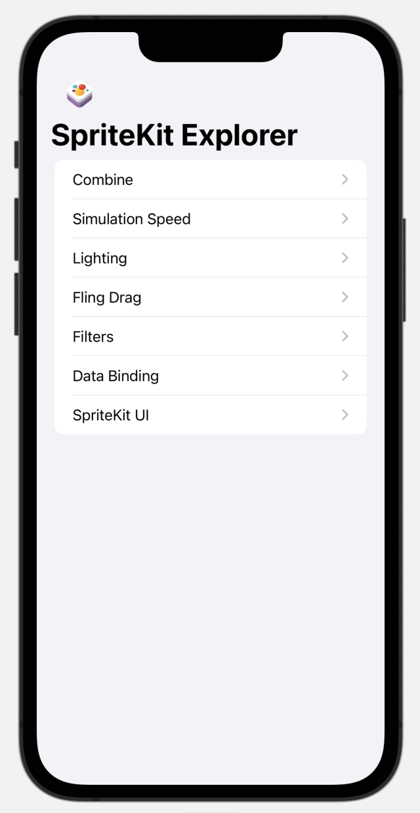

#  SpriteKit Explorer

An ongoing Xcode project to explore various aspects of SpriteKit. Since SpriteKit is a native Apple framework, it has many bridges to other frameworks such as UIKit or Core Image. Some of the files inside this project explore these bridges as well.

