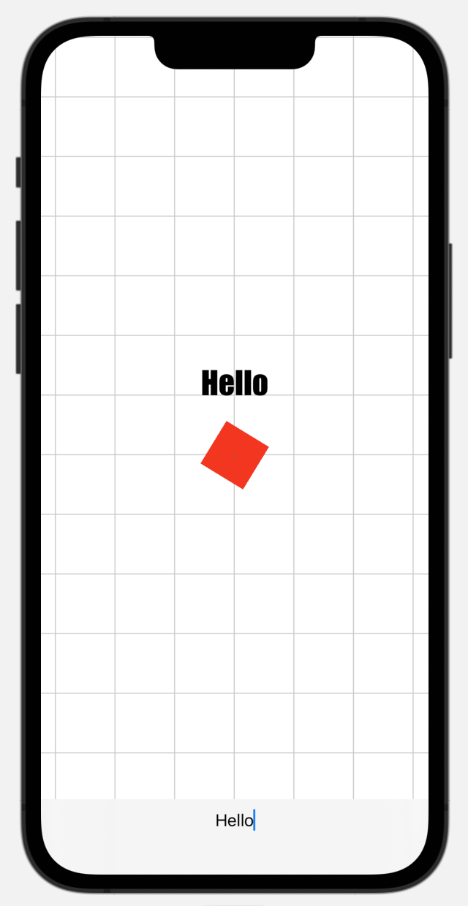
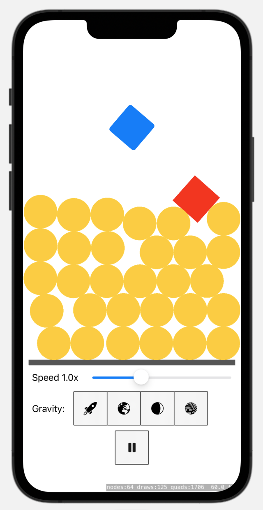
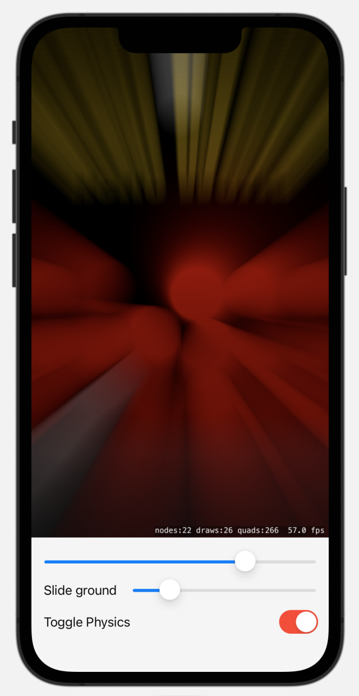
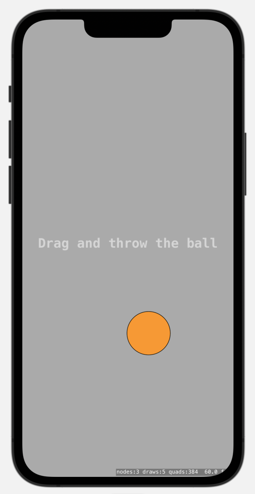
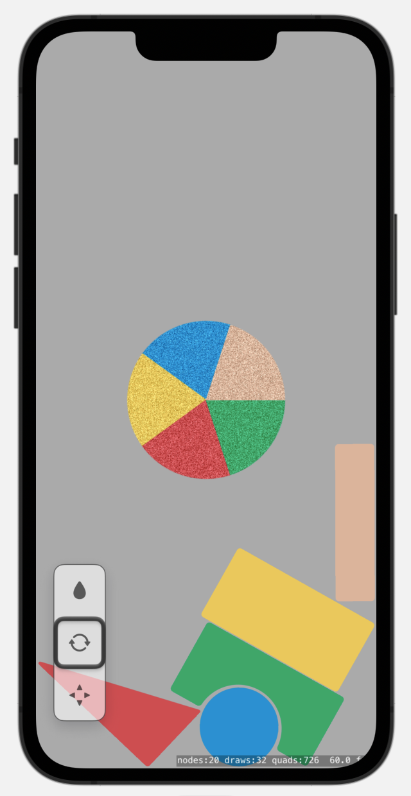

#  SpriteKit Explorer

An ongoing Xcode project to explore various aspects of SpriteKit. Since SpriteKit is a native Apple framework, it has many bridges to other frameworks such as UIKit or Core Image. Some of the files inside this project explore these bridges.

## Screenshots

## Usage

You can download the Xcode project, build, and run. However, most of the value is in the code itself.

This is a work in progress project. I'm learning SpriteKit as I'm writing the code.
