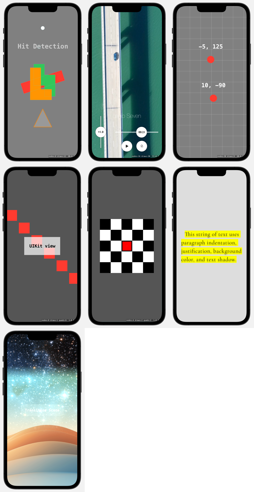

#  SpriteKit Explorer

An ongoing exploration of SpriteKit, Apple's native 2D game engine.

## Screenshots

## Usage

Download the Xcode project, and navigate the many files with code samples. The result of the code usually works on the live preview in Xcode.
